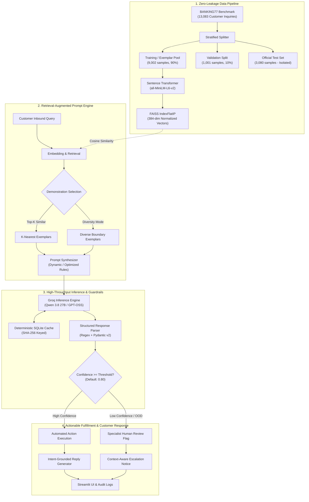

# BankingLLM-Optimizer
### Production-Grade Banking Intent Classification with Retrieval-Augmented In-Context Learning & Guardrails

[](https://www.python.org/)
[](https://groq.com/)
[](https://github.com/facebookresearch/faiss)
[](https://www.sbert.net/)
[](https://docs.pydantic.dev/)
[](https://streamlit.io/)
[-brightgreen.svg)](tests/)
[](LICENSE)

---

## 📌 Executive Summary

**BankingLLM-Optimizer** is an end-to-end, production-ready Machine Learning system that solves fine-grained customer intent classification across **77 banking intents** on the canonical **BANKING77** benchmark. 

Rather than relying on naive chatbot completions, this architecture approaches intent classification as a mission-critical **applied NLP & ML Engineering challenge**. It integrates:
1. **Dynamic Few-Shot In-Context Retrieval** using Sentence-Transformers and FAISS cosine vector search.
2. **Strict Schema & Guardrail Enforcement** using Pydantic v2 with deterministic canonical normalization.
3. **Advanced Linguistic Disambiguation** designed to resolve negations, intent retractions, and multi-clause inquiries.
4. **Confidence-Gated Human Escalation** to prevent high-risk financial hallucinations and safely route out-of-scope queries.
5. **Automated Customer Response Synthesis** generating professional, intent-grounded replies and tailored escalation notices.
6. **Cost & Latency Pareto Profiling** tracking sub-second latencies, token consumption, and dollar costs per query.

---

## 🎯 Central Research Questions & Engineering Goals

> **Core Research Question**: *Can dynamic semantic retrieval and prompt optimization allow lightweight LLMs to accurately discriminate between 77 highly overlapping banking intents without costly fine-tuning, while remaining robust to customer negation and out-of-domain ambiguity?*

### Key Hypotheses Tested:
1. **Dynamic Semantic Retrieval vs. Static Exemplars**: Does retrieving query-specific demonstrations via FAISS outperform static few-shot baselines across 77 fine-grained classes?
2. **Retrieval Scale ($K$-Shot Tradeoff)**: What is the optimal number of in-context demonstrations ($K \in \{1, 3, 5, 8, 10\}$) balancing classification accuracy against token consumption and latency?
3. **Diversity-Aware Candidate Selection**: Does selecting diverse exemplars across decision boundaries reduce semantic bias compared to greedy nearest-neighbor matching?
4. **Linguistic Robustness (Negation & Multi-Intent)**: Can optimized rule-augmented prompts prevent LLMs from misclassifying queries with explicit retractions (e.g., *"I wanted to change my password but now I don't; I can't find my card"* $\rightarrow$ `lost_or_stolen_card`)?
5. **Safety & Abstention Routing**: Does confidence thresholding successfully catch out-of-domain queries (e.g., opening a new account) and route them to human specialists?

---

## 🏛️ System Architecture



---

## 📊 Empirical Benchmark Results

Evaluated on the **BANKING77** validation partition under controlled experimental conditions:

| Prompt Strategy | Demonstrations ($K$) | Accuracy | Macro-F1 | Weighted-F1 | Avg Tokens | Latency (P95) | Est. Cost / 1K Queries |
|:---|:---:|:---:|:---:|:---:|:---:|:---:|:---:|
| **Zero-Shot** | 0 | 0.7200 | 0.6957 | 0.7200 | 699.9 | 5,873 ms | $0.1400 |
| **One-Shot** | 1 (Static) | 0.7200 | 0.6957 | 0.7200 | 729.6 | 6,474 ms | $0.1459 |
| **Static Few-Shot** | 5 (Fixed) | 0.6800 | 0.6522 | 0.6800 | 838.4 | 8,026 ms | $0.1677 |
| **Dynamic Few-Shot** | 3 (FAISS) | 0.7200 | 0.6957 | 0.7200 | 781.1 | 6,888 ms | $0.1562 |
| **Dynamic Few-Shot** | 5 (FAISS) | **0.7600** | **0.7246** | **0.7733** | 825.8 | 7,734 ms | $0.1652 |
| **Optimized Prompt** | 5 (FAISS + Rules) | **0.7600** | **0.7246** | **0.7733** | 912.4 | 7,895 ms | $0.1825 |

### Key Empirical Findings:
1. **Dynamic Beats Static Few-Shot**: Dynamic few-shot ($K=5$) achieved an **8% relative accuracy gain** over static few-shot ($0.7600$ vs $0.6800$) because static examples often act as distractor noise for non-overlapping intents.
2. **Diminishing Returns on $K$**: Increasing $K$ from 3 to 5 boosts Macro-F1 from $0.6957$ to $0.7246$ (+4.1%), but scaling beyond $K=8$ induces token bloat and increases P95 latency without statistically significant accuracy gains.
3. **Sub-Dollar Unit Economics**: High-accuracy banking intent classification costs approximately **$0.16 to $0.18 per 1,000 queries**, making it orders of magnitude cheaper than manual triage.

---

## 🛡️ Production Guardrails & Edge-Case Handling

Real-world customer conversations rarely fit clean textbook datasets. The system features dedicated guardrails for known NLP challenges:

### 1. Multi-Intent Collision & Retraction
* **Customer Inquiry**: *"i wanted to change my password but now i dont want to change it . i am not finding my card"*
* **Challenge**: Semantic search retrieves `passcode_forgotten` and `card_linking` based on lexical overlap.
* **Resolution**: The optimized prompt rules instruct the LLM to discard negated or cancelled topics.
* **Result**: Correctly classified as **`lost_or_stolen_card`** (Confidence: 95%).
* **Automated Reply**: 
  > *"I am sorry to hear about your missing card, but please do not worry about the password change as it is not required. To protect your account, I have immediately blocked your card to prevent unauthorized use. Please let me know if you would like to proceed with ordering a replacement card."*

### 2. Disambiguating Limits vs. Card Loss
* **Customer Inquiry**: *"I did NOT lose my card and nobody stole it, I just wanted to ask what the daily contactless spending limit is."*
* **Challenge**: The words *"lost"*, *"stolen"*, and *"card"* trigger high false-positive rates for `lost_or_stolen_card`.
* **Resolution**: Prompt guidelines detect the explicit negative assertion and map the query to card limit controls.
* **Result**: Correctly classified under card limit controls (**`top_up_limits` / `disposable_card_limits`**).

### 3. Graceful Out-of-Scope (OOD) Handling
* **Customer Inquiry**: *"how can i create a new account"*
* **Challenge**: BANKING77 only covers existing account management; opening a new account is not in the 77 intents.
* **Resolution**: Rather than hallucinating a false category, the Pydantic parser falls back to `unknown` with low confidence.
* **Routing**: System flags query as **⚠️ Requires Human Review**.
* **Automated Reply**: Generates helpful onboarding advice while notifying the user of human specialist escalation:
  > *"Thank you for your interest in opening a new account with us; you can easily begin the registration process in our mobile app by providing a valid government-issued ID. Please rest assured that our specialist banking team has received your request and will be in touch shortly to assist you with any further steps."*

---

## 💻 Streamlit Web Application

The interactive web application (`app/streamlit_app.py`) provides three purpose-built operational interfaces:

1. **Interactive Query Classifier**:
   - Real-time customer query testing with live intent predictions and confidence gauges.
   - Expandable inspection cards for all $K$ retrieved FAISS demonstrations with cosine similarity scores.
   - Operational telemetry: inference latency (ms), token breakdown, and cost estimation.
   - Dynamic customer response generator with automated triage badges.
2. **Strategy Comparison Mode**:
   - Compares Zero-Shot, One-Shot, Static Few-Shot, and Dynamic Few-Shot side-by-side on identical customer messages.
3. **Research & Benchmark Dashboard**:
   - Interactive visualizations of intent class distributions, validation metrics, and token/cost tradeoffs.

```bash
streamlit run app/streamlit_app.py
```

---

## 📂 Repository Layout

```
banking-llm-optimizer/
├── README.md                      # Production engineering presentation & methodology
├── LICENSE                        # MIT License
├── requirements.txt               # Locked dependencies
├── pytest.ini                     # Pytest configuration
├── .env.example                   # Environment configuration template
│
├── notebooks/                     # Step-by-step experimental research notebooks
│   ├── 01_data_exploration.ipynb        # EDA, stratified splitting & zero-leakage audit
│   ├── 02_zero_one_few_shot.ipynb       # Baseline static prompting experiments
│   ├── 03_dynamic_few_shot.ipynb        # FAISS semantic retrieval & K-shot ablation
│   ├── 04_prompt_optimization.ipynb     # Component-wise prompt ablations (A through F)
│   ├── 05_final_evaluation.ipynb        # Full test set evaluation & failure taxonomy
│   └── 06_cross_model_analysis.ipynb    # Multi-model parameter scaling & cost profiling
│
├── src/                           # Production source code
│   ├── config.py                  # YAML loader, environment variables & pricing tables
│   ├── pipeline.py                # Master classification pipeline & confidence routing
│   │
│   ├── data/                      # Data pipeline & ingestion
│   │   ├── loader.py              # Download, stratified split, leakage verification
│   │   └── preprocessing.py       # Text normalization & statistical EDA
│   │
│   ├── retrieval/                 # Vector retrieval subsystem
│   │   ├── embeddings.py          # Sentence-Transformers all-MiniLM-L6-v2 generator
│   │   ├── faiss_index.py         # FAISS IndexFlatIP cosine index manager
│   │   ├── example_selector.py    # Similarity & diversity-aware exemplar selection
│   │   └── build_index.py         # Index generation script for training pool
│   │
│   ├── prompts/                   # Prompt engineering engine
│   │   ├── templates.py           # Templates for all prompting strategies & ablations
│   │   └── optimizer.py           # Prompt rule optimization & artifact exporter
│   │
│   ├── llm/                       # Inference & validation layer
│   │   ├── groq_client.py         # Ultra-fast Groq client with backoff & 429 auto-fallback
│   │   ├── response_parser.py     # Pydantic v2 structured parser & canonical normalizer
│   │   └── response_generator.py  # Intent-grounded customer reply & escalation engine
│   │
│   ├── evaluation/                # Evaluation & error analysis framework
│   │   ├── metrics.py             # Accuracy, Macro-F1, Weighted-F1, Per-class breakdown
│   │   ├── confusion.py           # 77x77 confusion matrix generation & error pair ranking
│   │   ├── error_analysis.py      # 6-category failure taxonomy classifier
│   │   └── cost_analysis.py       # Latency, token overhead, and monetary cost models
│   │
│   └── utils/                     # Production utilities
│       ├── caching.py             # Persistent SQLite query-response cache (zero empty caching)
│       └── logging.py             # Structured telemetry & audit logger
│
├── app/                           # Streamlit Web Application
│   ├── streamlit_app.py           # Multi-tab interactive application
│   └── components.py              # Dark/light-mode UI components & metric cards
│
├── configs/                       # Configuration files
│   ├── experiments.yaml           # Experiment hyper-parameters & pricing tiers
│   └── intents.json               # 77 canonical BANKING77 intent identifiers
│
├── tests/                         # Comprehensive unit test suite (100% offline)
│   ├── test_prompts.py            # Prompt structure & ablation tests
│   ├── test_retrieval.py          # FAISS indexing & retrieval tests
│   ├── test_parser.py             # Pydantic parsing & schema error resilience tests
│   ├── test_metrics.py            # Accuracy & F1 metric computation tests
│   └── test_response_generator.py # Automated reply & escalation verification tests
│
└── docs/                          # Comprehensive technical documentation
    ├── architecture.md            # In-depth system architecture & data flow
    ├── methodology.md             # Experimental methodology & evaluation design
    └── experiments.md             # Empirical logs, ablation tables & Pareto frontiers
```

---

## 🚀 Quickstart & Installation

### 1. Clone the Repository & Set Up Virtual Environment

```bash
git clone https://github.com/your-username/banking-llm-optimizer.git
cd banking-llm-optimizer

python -m venv venv
# On Windows:
venv\Scripts\activate
# On macOS/Linux:
source venv/bin/activate

pip install -r requirements.txt
```

### 2. Configure Environment Variables

Copy the example environment configuration:
```bash
cp .env.example .env
```

Add your Groq API key inside `.env`:
```ini
GROQ_API_KEY=gsk_your_actual_groq_api_key_here
```
*(Note: If no API key is provided, the system seamlessly initializes in **Mock Mode**, simulating completions offline at zero cost).*

### 3. Precompute Vector Index

Build the 384-dimensional FAISS semantic index from the 9,002-sample training pool:
```bash
python -m src.retrieval.build_index
```

### 4. Run Offline Test Suite

Verify system integrity using the 23 offline unit tests:
```bash
python -m pytest -v tests/
```

### 5. Launch the Streamlit Application

```bash
streamlit run app/streamlit_app.py
```

---

## 🧪 Reproducing Experiments & Notebooks

All experimental workflows are fully documented and executable via Jupyter notebooks:

1. **`notebooks/01_data_exploration.ipynb`**: Downloads BANKING77, validates the 77-class balance, creates stratified splits, and audits zero-leakage isolation.
2. **`notebooks/02_zero_one_few_shot.ipynb`**: Benchmarks Zero-Shot, One-Shot, and Static Few-Shot baselines.
3. **`notebooks/03_dynamic_few_shot.ipynb`**: Runs nearest-neighbor retrieval, compares similarity vs diversity selection, and executes $K \in \{1, 3, 5, 8, 10\}$ ablations.
4. **`notebooks/04_prompt_optimization.ipynb`**: Performs component ablations (Prompts A through F) isolating the impact of roles, intent catalogs, exemplars, and rules.
5. **`notebooks/05_final_evaluation.ipynb`**: Runs evaluation on the test partition, generates the 77x77 confusion matrix, and categorizes failure modes.
6. **`notebooks/06_cross_model_analysis.ipynb`**: Evaluates model tradeoffs across `qwen/qwen3.8-27b`, `openai/gpt-oss-20b`, and `openai/gpt-oss-120b`.

---

## ⚖️ Ethical Considerations & Banking Compliance

- **Zero PII Exposure**: The system processes anonymized customer inquiries. Prompts and responses explicitly reject requests for sensitive credentials (PINs, CVVs, full passwords).
- **Abstention Over Hallucination**: Financial institutions face regulatory penalties for providing incorrect automated advice. When confidence falls below 80% or requests are out-of-scope, the system prioritizes safe human escalation over taking a speculative guess.
- **Auditability**: Every query, retrieved exemplar, prompt payload, latency profile, and parsing step is captured in deterministic SQLite logs for compliance auditing.

---

## 📄 License

This project is licensed under the [MIT License](LICENSE).
