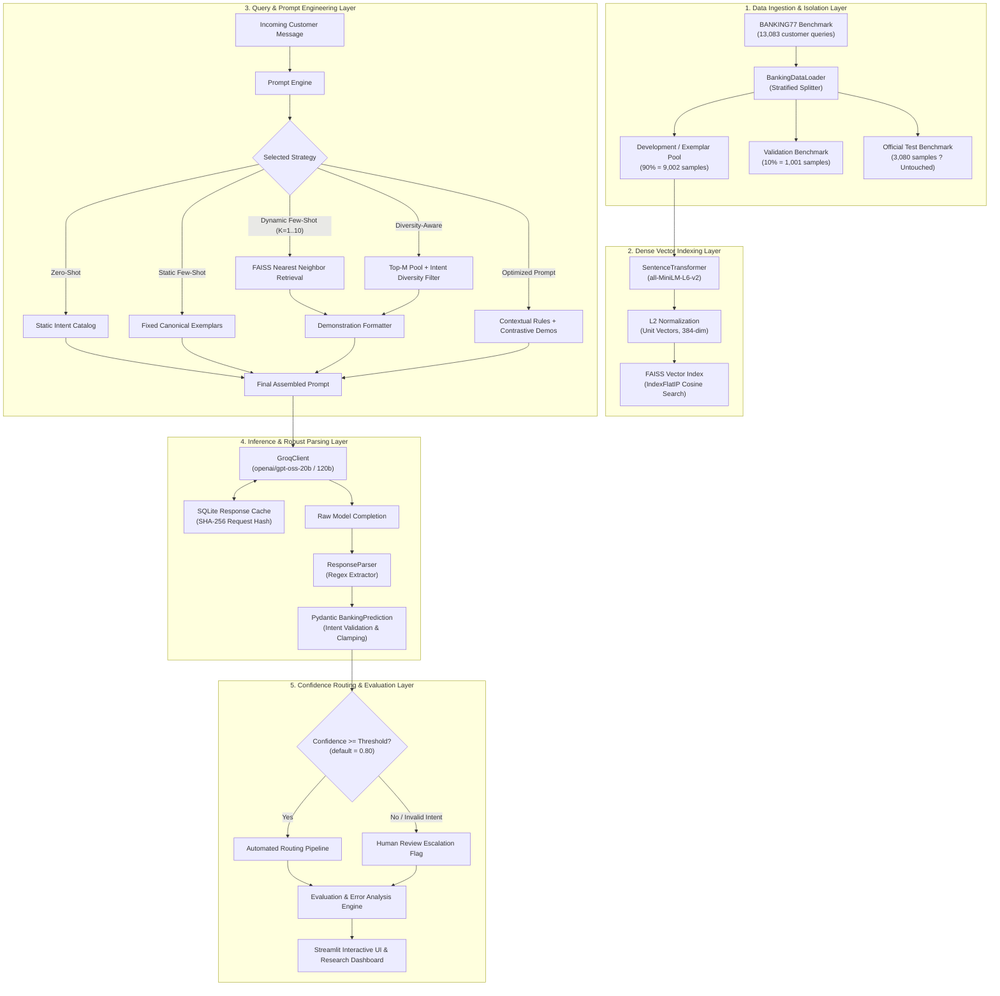

# System Architecture ? BankingLLM-Optimizer

`BankingLLM-Optimizer` is an enterprise-grade, research-oriented intent classification architecture built on the 77-class **BANKING77** benchmark. It combines dense semantic retrieval, in-context demonstration optimization, structured schema validation via Pydantic, confidence-based triage routing, and low-latency Groq inference.

---

## High-Level Architecture Diagram

---

## Detailed Architectural Components

### 1. Data Ingestion and Isolation Layer (`src/data/`)
- **`BankingDataLoader`**: Automates dataset acquisition directly from the canonical PolyAI repository.
  - Enforces a stratified 90/10 split on the official 10,003 training samples.
  - Generates a **9,002-sample Development/Demonstration Pool** and a **1,001-sample Validation Set**.
  - Isolates the **3,080 official test examples**, strictly guaranteeing zero data leakage into embedding indexes or prompt exemplars.
  - Verifies data integrity: identical class distributions, non-overlapping sample identifiers, and canonical 77-class coverage.
- **`TextPreprocessor`**: Sanitizes whitespace, assesses word/character distribution percentiles, and asserts non-empty query strings.

### 2. Dense Vector Indexing & Retrieval Layer (`src/retrieval/`)
- **`EmbeddingGenerator`**: Wraps Hugging Face's `sentence-transformers/all-MiniLM-L6-v2`. Computes dense 384-dimensional vector embeddings with $L_2$ normalization such that vector dot products are identical to cosine similarity:
  $$\text{sim}(u, v) = \frac{u \cdot v}{\|u\|_2 \|v\|_2} = \hat{u} \cdot \hat{v}$$
- **`FaissIndexManager`**: Manages a high-performance `faiss.IndexFlatIP` (exact inner product) index storing all 9,002 normalized training pool vectors.
- **`ExampleSelector`**: Provides dual retrieval strategies:
  - **Similarity-Only Search**: Returns the top-$K$ nearest neighbors directly sorted by cosine distance.
  - **Diversity-Aware Search**: Queries a candidate pool of $M=20$ nearest neighbors, keeps the top hit, and iteratively selects subsequent candidates from unrepresented intent classes. This exposes the LLM to contrastive class boundaries rather than redundant paraphrases of the same intent.

### 3. Prompt Engineering Layer (`src/prompts/`)
- **`PromptBuilder`**: Implements modular template interpolation for:
  - `Zero-Shot`: Full 77-intent enumeration without exemplars.
  - `One-Shot`: Single canonical baseline demonstration.
  - `Static Few-Shot`: Five fixed curated exemplars from the dev pool.
  - `Dynamic Few-Shot`: Injects top-$K$ semantically relevant demonstrations.
  - `Optimized`: Introduces role conditioning, strict boundary rules, contrastive guidance, and JSON schema constraints.
- **`PromptOptimizer`**: Implements systematic component ablations (Prompts A through F) to evaluate the marginal value of roles, intent lists, demonstrations, disambiguation rules, and schema directives.

### 4. Inference & Robust Parsing Layer (`src/llm/`)
- **`GroqClient`**: Connects to the Groq API utilizing ultra-low latency hardware acceleration.
  - Implements exponential backoff with configurable jitter for rate limits (HTTP 429) and network timeouts.
  - Accurately captures millisecond latency using `time.perf_counter()`.
  - Parses real token usage from Groq's `usage` payload (`prompt_tokens`, `completion_tokens`).
  - Provides a built-in `mock_mode` for offline continuous integration and dry-run test execution without API costs.
- **`ResponseParser` & `BankingPrediction`**:
  - Leverages Pydantic v2 to validate strict schema conformity: `intent` (string constrained to the canonical 77 intents), `confidence` (float bounded in $[0.0, 1.0]$), and `needs_review` (boolean).
  - Employs regex recovery to cleanly extract JSON from raw markdown code blocks or conversational chat wrappers.
  - Graceful fallback: malformed completions or unrecognized intents never raise unhandled exceptions; instead, they are flagged with `needs_review=True` and `intent="unknown"`.

### 5. Utilities, Caching & Logging Layer (`src/utils/`)
- **`LLMCache`**: Persistent SQLite database indexed by SHA-256 hash:
  $$\text{Key} = \text{SHA256}(\text{model} \parallel \text{temperature} \parallel \text{prompt})$$
  Completely eliminates redundant API calls for duplicate requests and allows large notebook experiments to be paused and resumed deterministically.
- **`ExperimentLogger`**: Emits structured JSON events recording experiment IDs, latency profiles, token metrics, and classifications without logging sensitive API keys.

### 6. Evaluation & Error Analysis Layer (`src/evaluation/`)
- **`ClassificationMetrics`**: Evaluates multi-class Accuracy, Macro Precision, Macro Recall, Macro-F1, and Weighted-F1 across all 77 intents.
- **`ConfusionAnalyzer`**: Computes the full $77 \times 77$ confusion matrix, exports publication-ready heatmaps, and ranks confusion pairs by misclassification frequency.
- **`CostAnalyzer`**: Dynamically computes inference expense based on configurable token pricing per 1M tokens, reporting cost per query, cost per 1,000 queries, and total campaign expenses.
- **`ErrorAnalyzer`**: Classifies failures into a 6-part empirical taxonomy (`semantic_similarity`, `ambiguous_query`, `missing_context`, `retrieval_error`, `classification_error`, `format_error`).

### 7. Application Layer (`app/`)
- **Streamlit Application**: Multi-tab interface featuring real-time query classification, dynamic demonstration inspection, multi-strategy side-by-side comparison, and research dashboards.
